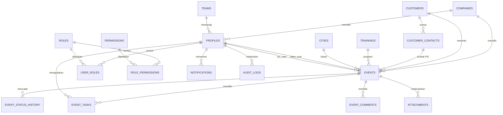
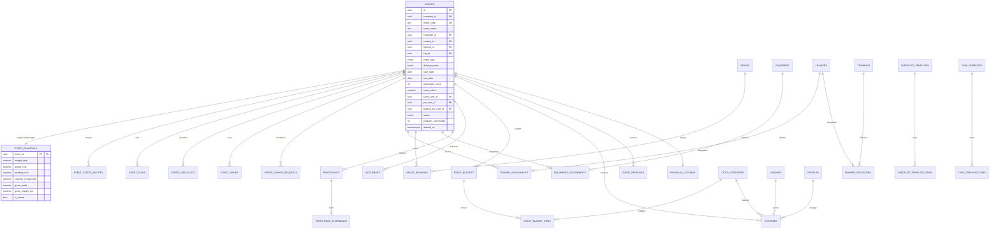

# System Design — EMOCS (Event Management & Operational Control System)

> Diturunkan dari **PRD EMOCS v1.1**. Dokumen ini adalah **sumber kebenaran teknis** ("bagaimana sistem dibangun") dan dipakai berdampingan dengan `AGENTS.md` (checklist operasional harian AI coding agent). Bila ada ketidaksesuaian: keputusan bisnis → PRD; keputusan implementasi teknis → dokumen ini; visual/UI → Design.md; workflow AI → AGENTS.md.
>
> **Status implementasi:** migrasi `0001`–`0029` telah mencakup skema **Phase 1–3** (core, master data, event, notifikasi, audit, Phase 2 operational control, Phase 3 financial). Phase 4 (BI) belum dimulai. Pengaktifan fitur tetap mengikuti phase gate di `AGENTS.md` §4.

---

## 1. Tujuan & Ruang Lingkup

### 1.1 Fungsi Dokumen

Dokumen ini menjawab "bagaimana sistem dibangun": arsitektur, layering, data model, state machine, API, security, NFR, testing, dan keputusan teknis beserta trade-off-nya.

| Domain | Sumber Kebenaran |
|---|---|
| Kebutuhan & keputusan bisnis | `PRD EMOCS — Product Requirements Document.md` (v1.1) |
| Implementasi teknis | **Dokumen ini** |
| Visual / UI / UX | Design.md |
| Cara kerja AI coding agent | `AGENTS.md` |

### 1.2 Delegasi Eksplisit dari PRD

PRD mendelegasikan tiga hal ke dokumen ini; ketiganya ditetapkan di sini:

| Delegasi | Lokasi di PRD | Ditentukan di |
|---|---|---|
| Mekanisme teknis penegakan status event | PRD §10.2 | §8 (State Machine) |
| Detail perhitungan finansial | PRD §19.1 | §7 (BR-FIN) & §6.6 |
| Target angka teknis (performa, uptime, backup, RPO, RTO) | PRD §25 | §14 |

### 1.3 Peta Rujukan AGENTS.md

`AGENTS.md` merujuk ke nomor bagian lama dokumen ini. Pemetaan ke penomoran baru:

| Rujukan lama di AGENTS.md | Isi | Sekarang |
|---|---|---|
| System_Design.md §3 | Detail state machine | §8 |
| System_Design.md §5 | ERD | §6.3–§6.4 |
| System_Design.md §7 | Permission Matrix | §10.3 |
| System_Design.md §14 | Business Rules (BR-*) | §7 |

---

## 2. Prinsip Arsitektur

1. **Visibility di atas segalanya.** Setiap fitur diuji dengan: "apakah ini menghilangkan kebutuhan bertanya status via WhatsApp?" (PRD §1.3)
2. **Database sebagai penjaga terakhir.** UI dan Server Action bisa dilewati; RLS, trigger, dan constraint tidak. Aturan yang menyangkut integritas (transisi status, Event ID, audit, progress, akses) **selalu** juga ada di database.
3. **Satu jalur transisi status.** Perubahan `status` event hanya melalui `transition_event_status` (DB function) yang dipanggil dari Server Action/endpoint khusus. Tidak pernah `UPDATE events SET status = ...` langsung — ditegakkan trigger penjaga.
4. **RLS `ENABLE` di setiap tabel, tanpa kecuali.** Tabel tanpa RLS bisa dibaca siapa pun pemegang `anon key` (ada di bundel JS browser). Item wajib code review.
5. **Data finansial hidup di tabel terpisah** (`event_financials`, `expenses`, dst.) dengan policy sendiri — RLS bekerja per baris, bukan per kolom. Ini keputusan keamanan, bukan normalisasi.
6. **Satu skema Zod, tiga pemakaian** — form klien (`zodResolver`), Server Action (`safeParse`, tidak pernah percaya klien), tipe TypeScript (`z.infer`).
7. **Audit append-only** via trigger generik `fn_audit()` — tidak ada UPDATE/DELETE pada `audit_logs`.
8. **Soft delete only** (`deleted_at`); hard delete dilarang. Master data yang terpakai transaksi hanya dinonaktifkan (`is_active = false`).
9. **Event ID (`EVT-YYYY-NNNNNN`) immutable, digenerate di database** secara atomik via `generate_event_code()` + tabel counter. Draft tidak mendapat Event ID.
10. **Uang `numeric(18,2)`** (tidak pernah `float`); **waktu `timestamptz` (UTC)**, ditampilkan Asia/Jakarta (WIB).
11. **Progress berasal dari pekerjaan yang selesai** — dihitung sistem dari task, tidak pernah diisi manual (PRD §14).
12. **Mobile-first untuk alur Operations** — pekerjaan utama harus selesai dari viewport 360px (PRD §24).
13. **No over-engineering.** Satu aplikasi Next.js + Supabase (Option A). Tidak ada microservices, queue terpisah, atau NoSQL sampai skala membuktikan sebaliknya (§18).
14. **"Issue"/"On Hold" bukan status event** — entitas/flag terpisah yang tampil sebagai badge; event tetap di status operasionalnya (§8.2).
15. **Batas trigger vs TypeScript:** taruh di database **hanya** yang wajib benar — generate Event ID, audit, progress/actual cost, penegakan akses & transisi. Logika alur yang sering berubah (aturan transisi detail, routing approval, isi notifikasi) hidup di TypeScript / tabel data agar mudah dibaca, diuji, direview (lihat §18 ADR-02).

---

## 3. Arsitektur Sistem

### 3.1 Gambaran Umum

**Keputusan: Option A — Rapid Development.** Next.js (App Router) + Supabase + Vercel dalam satu ekosistem terkelola (auth, database, storage, realtime, cron bawaan). Perbandingan lengkap Option A vs Option B ada di §18.1.

```text
┌─────────────────────── Vercel (Singapore) ───────────────────────┐
│  Next.js 16 App Router (Turbopack, TypeScript strict)            │
│   ├─ React Server Components  → baca data (klien sesi user)      │
│   ├─ Server Actions           → mutasi (Zod + permission + RLS)  │
│   └─ Route Handlers /api/v1   → webhook, cron, integrasi eksternal│
└──────────────┬───────────────────────────────┬───────────────────┘
               │ sesi user (JWT + RLS)         │ service_role (job saja)
┌──────────────▼───────── Supabase (ap-southeast-1) ───────────────┐
│  Postgres  : tabel + RLS + trigger + fungsi + view + pg_cron     │
│  Auth      : Google OAuth (utama) + email/password (fallback),   │
│              invite-only, Custom Access Token Hook (role → JWT)  │
│  Storage   : bucket privat + signed URL (lampiran, dokumen)      │
│  Realtime  : notifikasi in-app, perubahan status                 │
│  pg_cron   : job terjadwal (overdue task)                        │
└──────────────────────────────────────────────────────────────────┘
```

### 3.2 Tech Stack

| Lapisan | Teknologi | Catatan |
|---|---|---|
| Framework | Next.js 16 App Router (Turbopack), TypeScript strict | Fullstack satu repo |
| UI | Tailwind CSS v4 + shadcn/ui v4 (Base UI — bukan Radix) + lucide-react | |
| Form & Validasi | react-hook-form + Zod v4 (`@hookform/resolvers`) | Satu skema, klien & server |
| State server | TanStack Query | Hanya layar interaktif |
| Database | Supabase Postgres | RLS, trigger, view |
| Auth | Supabase Auth — Google OAuth + email/password | `@supabase/ssr` |
| Storage | Supabase Storage | Bucket privat + signed URL |
| Realtime | Supabase Realtime | Notifikasi & status |
| Job terjadwal | `pg_cron` | `check_overdue_tasks()` |
| Email | Resend (HTTP API via `lib/services/email-service.ts`) | Dispatch: `notification-dispatch.ts` |
| WhatsApp (Phase 2) | Penyedia WABA resmi | Jangan pakai gateway tidak resmi — risiko blokir nomor |
| Error monitoring | Sentry | *Rencana — belum terpasang* |
| Hosting | Vercel (Singapore) + Supabase (`ap-southeast-1`) | Latensi terbaik untuk Indonesia |
| CI/CD | GitHub Actions → Vercel; migrasi via Supabase CLI | *Rencana* — saat ini workflow belum ada; file-based, bukan klik dashboard |
| Testing | Vitest (unit) · Playwright (E2E) · pgTAP (RLS — wajib) | §15 — **rencana; Vitest/Playwright belum terpasang** |
| Package manager | npm (`package-lock.json`) | |

### 3.3 Environments & CI/CD

| Lingkungan | Tujuan | Database | Data |
|---|---|---|---|
| Local | Pengembangan | Supabase local (Docker) | Seed |
| Staging | UAT & demo | Project Supabase terpisah | Anonim |
| Production | Operasional | Project Supabase produksi | Nyata |

Migrasi berjalan dari repo (`supabase db push`) melalui CI. **Perubahan skema langsung di dashboard produksi dilarang.**

### 3.4 Migration & Go-Live (Ringkasan)

- Google Form **dimatikan** pada hari go-live — tidak ada dual-channel. "Tidak boleh ada dua sumber kebenaran untuk request event" (PRD §30).
- Data spreadsheet lama diaudit & dibersihkan sebelum migrasi (master customer & training dinormalisasi).
- Migrasi historis: **12 bulan penuh detail + 24 bulan ringkasan**.
- Event yang dibatalkan tetap disimpan selamanya — data berharga untuk analitik (PRD §11.5.1).

---

## 4. Layer / Batas Tanggung Jawab

| Layer | Lokasi | Tanggung Jawab | Dilarang |
|---|---|---|---|
| L6 UI | `app/`, `components/` | Render, form, state lokal, state empty/loading/error | Logika bisnis; mutasi langsung ke Supabase dari komponen |
| L5 Validasi | `lib/validations/` | Skema Zod — satu-satunya definisi aturan bentuk data | Duplikasi validasi manual |
| L4 Aplikasi | `actions/`, `app/api/v1/` | Orkestrasi: validasi Zod → verifikasi sesi → verifikasi permission → panggil service/DB → audit → `revalidatePath` | Percaya input klien; pakai `service_role` di jalur user |
| L3 Service | `lib/services/` | Logika bisnis reusable (notifikasi, dsb.) | Akses DB tanpa konteks permission |
| L2 Akses data | `lib/supabase/` | Klien Supabase (server / browser / admin) | Mengekspos klien admin ke klien browser |
| L1 Database | `supabase/migrations/` | Tabel, RLS, trigger, fungsi, view — penjaga terakhir | — |

**Aturan batas (hard rules):**

1. **Setiap Server Action wajib**: (1) validasi Zod via `safeParse`, (2) verifikasi sesi, (3) verifikasi permission/role (untuk UX error yang baik — RLS tetap penjaga final), (4) pakai klien Supabase ber-sesi user, (5) tulis audit bila relevan, (6) `revalidatePath`.
2. **`service_role` hanya untuk cron/job admin** (`lib/supabase/admin.ts` tidak boleh diimpor di jalur permintaan user biasa) — dipakai di Server Action biasa = seluruh RLS tidak berguna.
3. Pembacaan render halaman boleh langsung dari Server Components ke Supabase (RLS aktif); **mutasi** hanya melalui Server Action atau endpoint transisi.
4. Aturan integritas tidak boleh hanya ada di layer aplikasi — database wajib punya guard-nya sendiri (trigger/constraint/policy).

---

## 5. Modul & Fitur

### 5.1 Peta Modul per Phase

| Modul | P1 MVP | P2 | P3 | P4 |
|---|:-:|:-:|:-:|:-:|
| Login, User & Role Management | ✓ | | +MFA Finance/Admin | |
| Master Data (customer, kontak, training, kota) | ✓ | +trainer, venue, equipment | +cost category, vendor | |
| Event Request + Draft (target isi ≤3 menit) | ✓ | | | |
| Event ID & Status Workflow | ✓ | +Change Request | | |
| Review & Approval | ✓ | | | |
| PIC Assignment (pic + backup) & workload | ✓ | | | |
| Task & Progress otomatis | ✓ | +task template | | |
| Event Detail, Timeline, Komentar, Lampiran | ✓ | +dokumen terstruktur | | |
| Notifikasi in-app (Realtime) | ✓ | +email, +WhatsApp `[OQ-19]` | +financial approval/closing | |
| Dashboard Sales / Operations / Management | ✓ | +workload detail | +finansial | +BI |
| Audit trail | ✓ | | | |
| Cancel / Postpone | ✓ | | | |
| Checklist (dari template, dapat disesuaikan per event) | | ✓ | | |
| Issue Management (entitas + flag, bukan status) | | ✓ | | |
| Document Management | | ✓ | | |
| Participant Management (data pribadi — UU PDP) | | ✓ | | |
| Budget, Expense, Approval, Revenue, Margin, Financial Closing | | | ✓ | |
| Cost Benchmark, Estimator, Profitability, Forecasting | | | | ✓ |

> Skema Phase 2–3 sudah disiapkan via migrasi; fitur diaktifkan bertahap mengikuti phase gate (`AGENTS.md` §4). Larangan scope creep tetap berlaku: jangan tambah modul finansial "sekalian" ke alur Phase 1.

### 5.2 Scope MVP (Phase 1)

MUST HAVE / SHOULD HAVE / COULD HAVE / OUT OF SCOPE mengikuti PRD §22 — tidak diduplikasi di sini. Inti MVP: **Event Request → Review → Assignment → Tracking** dengan definisi sukses *"Sales dapat mengetahui progres event kapan saja tanpa bertanya kepada Operations."*

### 5.3 Notifikasi

Trigger (PRD §15): event submitted, approved, rejected, revision requested, PIC assigned, PIC changed, task assigned, task overdue, event status changed, event completed, cancelled, postponed, masalah kritis, financial approval, financial closing.

Implementasi:

- `create_notification()` + trigger `notify_event_status_change()`, `notify_task_assigned()`, `notify_critical_issue()` menulis baris `notifications` dalam transisi yang sama (tidak bisa terlewat).
- In-app: Supabase Realtime pada `notifications` (migrasi `0013_realtime_notifications`).
- Email/WA: baris `notification_deliveries` diantrekan `create_notification()` dan dikosongkan `lib/services/notification-dispatch.ts` (admin client) tepat setelah RPC/insert sukses — bukan lewat Edge Function (migrasi `0022_phase2_email_delivery`); kegagalan kanal **tidak** membatalkan transaksi bisnis.
- Prinsip: notifikasi membantu user mengambil tindakan (selalu bawa konteks + link ke event), bukan membanjiri (PRD §15).

### 5.4 Fokus Phase 2–4

- **Phase 2**: Operations menjalankan event end-to-end — trainer/venue/equipment, peserta (data pribadi), dokumen, issue, checklist, task template, change request, SLA & escalation, WhatsApp.
- **Phase 3**: Finance mengetahui biaya & profitabilitas aktual per event — budget, expense + approval berjenjang, revenue, margin, financial closing.
- **Phase 4**: data historis jadi alat keputusan — benchmark, estimator, profitability, forecasting. Prinsip wajib (PRD §20): sistem tidak boleh memberi kesan estimasi akurat bila data pembanding tidak cukup; estimator harus bisa berkata *"data belum cukup."*

---

## 6. Data Model

### 6.1 Konvensi

| Aspek | Standar |
|---|---|
| Primary key | `uuid` (`gen_random_uuid()`) |
| Business key | `event_code` (`EVT-YYYY-NNNNNN`) — unik, user-facing, immutable |
| Penamaan | `snake_case`, tabel jamak, FK `<entitas>_id` |
| Audit field | `created_at`, `created_by`, `updated_at`, `updated_by` di seluruh tabel utama |
| Soft delete | `deleted_at timestamptz null`; seluruh query & policy filter `deleted_at is null` |
| Waktu | `timestamptz` (UTC); tanggal murni pakai `date` |
| Uang | `numeric(18,2)`; kolom `currency` default `IDR` |
| Enum | Postgres `enum` untuk nilai stabil (status); tabel referensi untuk nilai yang sering berubah (cost category) |
| Multi-entitas | `company_id` di seluruh tabel transaksional sejak Phase 1 — murah sekarang, mahal nanti `[OQ-22]` |
| RLS | `ENABLE ROW LEVEL SECURITY` di **setiap** tabel, tanpa kecuali |

### 6.2 Entitas per Phase

| Phase | Entitas |
|---|---|
| 1 | `companies`, `profiles`, `roles`, `user_roles`, `permissions`, `role_permissions`, `teams`, `invited_emails`, `customers`, `customer_contacts`, `trainings`, `cities`, `events`, `event_status_transitions`, `event_status_history`, `event_tasks`, `event_comments`, `attachments`, `notifications`, `notification_deliveries`, `audit_logs`, `event_number_counters` |
| 2 | `trainers`, `trainer_specialties`, `trainer_assignments`, `venues`, `venue_bookings`, `equipment`, `equipment_assignments`, `participants`, `participant_attendance`, `documents`, `event_issues`, `checklist_templates`, `checklist_template_items`, `event_checklists`, `task_templates`, `task_template_items`, `event_change_requests` |
| 3 | `cost_categories`, `vendors`, `event_budgets`, `event_budget_items`, `expenses`, `expense_status_history`, `approval_thresholds`, `event_revenues`, `financial_closings` |
| 4 | `mv_event_financial_summary`, `mv_customer_profitability`, `mv_training_profitability`, `mv_cost_benchmark`, `cost_estimations` (materialized view + tabel estimasi) |

### 6.3 ERD — Konseptual (Phase 1)



### 6.4 ERD — Logical (Phase 1–4)



### 6.5 Tabel Inti Phase 1

**`profiles`** (extend `auth.users`): `id` (PK = `auth.users.id`), `company_id` FK, `full_name`, `email` (unik), `phone` (untuk WA), `team_id` FK, `job_title`, `avatar_url`, `is_active`, `notification_prefs` jsonb, + audit fields. Dibuat otomatis oleh `handle_new_user()` saat undangan diterima.

**`events`** (tabel inti):

| Kolom | Tipe | Null | Keterangan |
|---|---|---|---|
| `id` | uuid PK | ✗ | |
| `company_id` | uuid FK | ✗ | |
| `event_code` | text | ✓ | unik; null saat DRAFT, terisi saat submit |
| `event_name` | text | ✗ | |
| `customer_id`, `contact_id`, `training_id` | uuid FK | ✗ | |
| `event_type` | enum | ✗ | INHOUSE/PUBLIC/ONLINE/HYBRID/ASSESSMENT |
| `delivery_mode` | enum | ✗ | OFFLINE/ONLINE/HYBRID |
| `start_date`/`end_date` | date | ✗ | |
| `start_time`/`end_time` | time | ✓ | |
| `duration_days` | int | ✗ | |
| `location_type` | enum | ✗ | |
| `location_name` | text | ✓ | wajib bila bukan ONLINE (CHECK) |
| `city_id` | uuid FK | ✓ | wajib bila bukan ONLINE |
| `participant_count` | int | ✗ | CHECK > 0 |
| `sales_value` | numeric(18,2) | ✓ | |
| `po_status` | enum | ✗ | NO_PO/PO_PENDING/PO_RECEIVED/VERBAL_COMMITMENT `[OQ-7]` |
| `po_number` | text | ✓ | wajib bila PO_RECEIVED |
| `sales_user_id`, `pic_user_id`, `backup_pic_user_id` | uuid FK → profiles | | `backup_pic_user_id` CHECK ≠ `pic_user_id` |
| `status` | enum `event_status` | ✗ | default DRAFT; hanya berubah via transisi |
| `priority` | enum | ✗ | default NORMAL |
| `is_rush` | boolean | ✗ | dihitung trigger `compute_event_is_rush()` (start_date < H+7 saat submit) |
| `progress_percentage` | int | ✗ | default 0, hanya diisi trigger |
| `cancellation_reason`/`cancellation_category` | text/enum | ✓ | wajib bila CANCELLED |
| `submitted_at`, `approved_at`, `completed_at`, `closed_at` | timestamptz | ✓ | |
| audit + `deleted_at` | | | |

Index: `status`, `start_date`, `sales_user_id`, `pic_user_id`, `customer_id`, `training_id`, `city_id`, `company_id`, komposit `(status, start_date)`, `(sales_user_id, status)`, `(pic_user_id, status)`, GIN full-text `to_tsvector('simple', event_name || ' ' || coalesce(event_code,''))`.

**`event_status_history`**: `id`, `event_id` FK, `from_status`, `to_status`, `changed_by` FK, `changed_at`, `reason`, `metadata` jsonb. Insert-only. Index: `(event_id, changed_at desc)`.

**`event_status_transitions`**: matriks transisi yang sah (`from_status`, `to_status`, role yang boleh, prasyarat) — **data, bukan hardcode**; dibaca `transition_event_status()`. Shortcut transisi (mis. DRAFT → APPROVED) ditolak karena tidak ada barisnya; testing pakai seed, bukan pelonggaran matriks.

**`event_tasks`**: `id`, `event_id` FK, `title`, `description`, `assignee_user_id` FK, `due_date` NOT NULL, `priority`, `status`, `is_mandatory` bool, `blocked_reason`, `completed_at`, `completed_by`, `sort_order`, audit, `deleted_at`. Index: `(event_id)`, `(assignee_user_id, status)`, partial `(due_date) where status not in ('DONE','CANCELLED')`.

**`notifications`**: `id`, `recipient_user_id` FK, `type`, `title`, `body`, `entity_type`, `entity_id`, `link_url`, `priority`, `is_read`, `read_at`, `created_at`. Index: partial `(recipient_user_id, created_at desc) where is_read = false`. **`notification_deliveries`**: jejak pengiriman per kanal (in-app/email/WA).

**`audit_logs`**: `id`, `company_id`, `table_name`, `record_id`, `action` (INSERT/UPDATE/DELETE), `actor_user_id`, `actor_email`, `old_values` jsonb, `new_values` jsonb, `changed_fields` text[], `ip_address`, `user_agent`, `created_at`. Index: `(table_name, record_id, created_at desc)`, `(actor_user_id, created_at desc)`. Append-only (§13).

**`event_number_counters`**: counter per tahun untuk `generate_event_code()`.

### 6.6 Pemisahan Finansial (Phase 3) — Keputusan Keamanan, Bukan Normalisasi

`event_financials` dipisah dari `events` karena **RLS bekerja per baris**. Menaruh `actual_cost`/`gross_margin` di `events` berarti siapa pun yang boleh baca event juga otomatis baca angka finansial.

`event_financials`: `event_id` PK/FK, `budget_total`, `actual_cost`, `pending_cost`, `revenue_recognized`, `cash_received`, `gross_profit`, `gross_margin_pct`, `is_closed`, `closed_at`, `closed_by`, `closing_note`. Kolom turunan diperbarui trigger (`compute_event_costs`, `compute_event_revenue`, `compute_budget_variance`), **tidak** dihitung ulang di aplikasi setiap pembacaan. Akses per baris via `can_view_event_financials()`.

Detail perhitungan (Revenue Recognized, Actual Cost, Gross Profit, Gross Margin) mengikuti definisi PRD §19.1 dan ditegakkan oleh BR-FIN (§7.5).

### 6.7 Relasi & Kardinalitas Utama

| Relasi | Kardinalitas | Aturan hapus |
|---|---|---|
| company → events | 1:N | RESTRICT |
| customer → events | 1:N | RESTRICT |
| customer → contacts | 1:N | CASCADE (soft) |
| training → events | 1:N | RESTRICT |
| event → tasks | 1:N | CASCADE |
| event → status_history | 1:N | RESTRICT (riwayat tidak boleh hilang) |
| event → documents / expenses | 1:N | RESTRICT |
| event → financials | 1:1 | CASCADE |
| event ↔ trainers / equipment | M:N via assignment table | RESTRICT |
| profile ↔ roles | M:N via `user_roles` | CASCADE |
| event → participants | 1:N | RESTRICT |

### 6.8 Rekomendasi Index

| Tabel | Index | Alasan |
|---|---|---|
| `events` | `(company_id, status, start_date)` | Filter utama seluruh dashboard |
| `events` | `(sales_user_id, status)` / `(pic_user_id, status)` | "Event saya" |
| `events` | unique `(event_code)` | Business key |
| `events` | GIN full-text `event_name` | Pencarian |
| `event_tasks` | `(event_id)`, partial `(due_date) where status not in ('DONE','CANCELLED')` | Task overdue |
| `event_status_history` | `(event_id, changed_at desc)` | Timeline |
| `expenses` | `(event_id, status)`, `(status, expense_date)` | Actual cost & antrean approval |
| `notifications` | partial `(recipient_user_id, created_at desc) where is_read = false` | Lonceng notifikasi |
| `audit_logs` | `(table_name, record_id, created_at desc)` | Penelusuran |
| `participants` | `(event_id)` | Daftar peserta |

Aturan praktis: index pada **setiap** foreign key (Postgres tidak membuatnya otomatis) dan setiap kolom yang muncul di filter dashboard.

### 6.9 Fungsi & Trigger Database (Inventory)

Semua perubahan skema hanya lewat `/supabase/migrations`. Fungsi kunci yang sudah ada:

| Fungsi / Trigger | Tujuan |
|---|---|
| `generate_event_code()` + `event_number_counters` | Event ID atomik, bebas race (AC-04 PRD) |
| `transition_event_status(p_event_id, p_to_status, ...)` | **Satu-satunya jalur** perubahan status: validasi matriks, role, prasyarat; tulis history; buat notifikasi |
| `guard_event_status_change()` | Trigger penolak UPDATE `status` langsung → `INVALID_TRANSITION` |
| `recalc_event_progress()` / `guard_event_progress_write()` | Progress dihitung sistem, tidak dapat ditulis manual |
| `compute_event_is_rush()` | Tandai RUSH (start_date < H+7 saat submit) |
| `validate_pic_role()` / `assign_pic()` | PIC wajib user Operations aktif; penugasan tercatat + notifikasi |
| `set_task_completed_at()` / `guard_task_parent_event_state()` | `completed_at` otomatis; task tidak bisa dibuat pada event CLOSED/CANCELLED |
| `has_role()` / `has_any_role()` | Cek role dari JWT (dipakai RLS & aplikasi) |
| `custom_access_token_hook()` | Sematkan roles ke JWT saat login/refresh |
| `handle_new_user()` | Buat `profiles` saat undangan diterima |
| `create_notification()` / `notify_event_status_change()` / `notify_task_assigned()` / `notify_critical_issue()` | Notifikasi dalam transaksi yang sama |
| `fn_audit()` | Audit generik append-only (§13) |
| `set_updated_at()` | `updated_at` otomatis; dipakai juga sebagai versi optimistic locking (§12.3) |
| `guard_master_data_in_use()` | Master data terpakai tidak bisa dihapus/nonaktifkan sembarangan |
| `check_overdue_tasks()` (pg_cron 06:00 WIB) | Tandai & notifikasi task overdue |
| `find_checklist_template()` / `generate_event_checklist()` | Checklist otomatis dari template sesuai karakter event |
| `log_participant_export()` | Audit ekspor data pribadi peserta |
| `apply_change_request()` | Terapkan/tolak change request (Phase 2) |
| `submit_expense()` / `decide_expense()` / `mark_expense_paid()` + guard `guard_expense_*` | Alur approval expense (Phase 3) |
| `resolve_approval_tier()` / `resolve_approver_max_rank()` + `approval_thresholds` | Approval berjenjang berbasis **data** (ambang bisa dikonfigurasi per company `[OQ-9/OQ-10]`) |
| `compute_event_revenue()` / `compute_event_costs()` / `compute_budget_variance()` / `can_view_event_financials()` | Perhitungan & kontrol akses finansial (Phase 3) |
| `apply_financial_closing()` | Closing: snapshot angka, wajib syarat terpenuhi |

---

## 7. Business Rules

Format: `BR-<AREA>-<NO>`. Kolom "Ditegakkan di" menunjukkan layer wajib — aturan penting **selalu** ditegakkan di database karena UI dapat dilewati.

### 7.1 Event

| ID | Aturan | Ditegakkan di |
|---|---|---|
| BR-EVT-01 | Event ID unik, tidak dapat diubah, tidak dipakai ulang | DB (unique + trigger tolak update) |
| BR-EVT-02 | Event ID hanya dibuat saat transisi DRAFT → SUBMITTED | DB (trigger) |
| BR-EVT-03 | Draft hanya terlihat pembuat & Admin | DB (RLS) |
| BR-EVT-04 | Submit hanya jika field mandatory lengkap & valid | Zod + Server Action |
| BR-EVT-05 | `end_date` ≥ `start_date` | Zod + DB (CHECK) |
| BR-EVT-06 | `start_date` tidak boleh masa lalu saat submit (kecuali Admin) | Zod + Server Action |
| BR-EVT-07 | Tidak bisa PREPARATION sebelum APPROVED & punya PIC | Server Action + DB |
| BR-EVT-08 | Tidak bisa READY bila checklist mandatory belum selesai | Server Action (Phase 2) |
| BR-EVT-09 | Tidak bisa READY bila ada issue CRITICAL terbuka | Server Action (Phase 2) |
| BR-EVT-10 | Tidak bisa COMPLETED sebelum end_date (kecuali override Ops Mgr + alasan) | Server Action |
| BR-EVT-11 | CANCELLED wajib alasan + kategori pembatalan | Zod + DB (CHECK) |
| BR-EVT-12 | POSTPONED mengosongkan tanggal & wajib alasan (belum ada jadwal final — PRD §27) | Server Action |
| BR-EVT-13 | CLOSED read-only kecuali reopen Admin/Finance Manager | DB (RLS + trigger) |
| BR-EVT-14 | Transisi hanya lewat endpoint transisi, tidak update field biasa | Server Action + DB (trigger penjaga) |
| BR-EVT-15 | Setiap transisi tercatat di `event_status_history` | DB (trigger) |
| BR-EVT-16 | Perubahan tanggal/lokasi/peserta setelah APPROVED memicu Change Request | Server Action (Phase 2) |
| BR-EVT-17 | Event tidak dapat dihapus; hanya CANCELLED atau soft delete Admin | DB (RLS) |
| BR-EVT-18 | Satu customer boleh memiliki banyak event, termasuk pada tanggal yang sama (duplikat request tetap diberi peringatan — PRD §27) | — (desain relasi + cek duplikat saat submit) |
| BR-EVT-19 | `start_date` < H+7 saat submit ditandai RUSH | DB (generated/trigger) |
| BR-EVT-20 | `progress_percentage` hanya dihitung sistem | DB (trigger) |

### 7.2 Assignment & Task

| ID | Aturan | Ditegakkan di |
|---|---|---|
| BR-PIC-01 | PIC harus user aktif role Operations | Server Action + DB (FK+CHECK) |
| BR-PIC-02 | Backup PIC ≠ PIC utama | Zod + DB (CHECK) |
| BR-PIC-03 | Backup PIC wajib untuk event HIGH/URGENT | Server Action |
| BR-PIC-04 | Penggantian PIC tercatat + notifikasi Sales & PIC baru | Server Action |
| BR-TSK-01 | Task wajib punya assignee & due date | Zod + DB (NOT NULL) |
| BR-TSK-02 | Task BLOCKED wajib alasan | Zod + DB (CHECK) |
| BR-TSK-03 | Task DONE mengisi `completed_at` otomatis | DB (trigger) |
| BR-TSK-04 | Task lewat tenggat ditandai otomatis 06:00 WIB | pg_cron |
| BR-TSK-05 | Task CANCELLED tidak dihitung progres | Perhitungan |
| BR-TSK-06 | Task tidak dapat dibuat pada event CLOSED/CANCELLED | DB (RLS/trigger) |
| BR-TSK-07 | Task mandatory harus selesai sebelum event READY | Server Action |

### 7.3 Trainer, Venue, Equipment, Participant (Phase 2)

- **BR-TRN-01–04**: konflik jadwal trainer ditolak; sertifikasi kedaluwarsa diblokir; minimal 1 trainer MAIN; penggantian trainer dicatat sebagai REPLACED, bukan diedit.
- **BR-VEN-01–02**: bentrok venue ditolak; venue wajib CONFIRMED sebelum event READY.
- **BR-EQP-01–02**: stok equipment divalidasi; pengembalian ≤ 3 hari pasca event.
- **BR-PAR-01–04**: kuota +10% butuh Change Request; akses detail peserta terbatas (PIC/Ops Mgr/Admin `[OQ-5]`); ekspor tercatat di audit (`log_participant_export`); sertifikat butuh syarat kehadiran minimum.

### 7.4 Financial (Phase 3)

| ID | Aturan |
|---|---|
| BR-FIN-01 | Setiap expense wajib terhubung 1 Event ID (NOT NULL) |
| BR-FIN-02 | Expense wajib approval sebelum masuk actual cost |
| BR-FIN-03 | `actual_cost` = jumlah expense APPROVED + PAID |
| BR-FIN-04 | Pengaju tidak boleh menyetujui expense-nya sendiri (PRD §11.4.3) |
| BR-FIN-05 | Approver sesuai ambang nilai berlaku (`approval_thresholds`) |
| BR-FIN-06 | Expense > Rp100.000 wajib lampirkan bukti |
| BR-FIN-07 | Expense pada event CLOSED ditolak (kecuali reopen) |
| BR-FIN-08 | Financial closing hanya jika tidak ada expense pending & dokumen wajib lengkap |
| BR-FIN-09 | Angka finansial dikunci (snapshot) saat closing |
| BR-FIN-10 | Reopen event CLOSED wajib alasan + audit log |
| BR-FIN-11 | Revenue diakui saat status COMPLETED, bukan saat pembayaran diterima `[OQ-11]` |
| BR-FIN-12 | Margin negatif wajib penjelasan tertulis saat closing |
| BR-FIN-13 | Budget revisi membuat versi baru, versi lama tetap tersimpan |
| BR-FIN-14 | Expense yang melampaui budget kategori >15% naik satu tingkat approval |
| BR-FIN-15 | Data finansial hanya terlihat role berwenang (RLS, bukan UI) |

Definisi perhitungan (PRD §19.1): Revenue Recognized diakui atas event terlaksana; Actual Cost = biaya disetujui; Gross Profit = Revenue − Actual Cost; Gross Margin = Gross Profit / Revenue × 100%.

### 7.5 Data & Sistem

| ID | Aturan |
|---|---|
| BR-SYS-01 | Seluruh tabel utama soft delete (`deleted_at`), bukan hard delete |
| BR-SYS-02 | Setiap tabel utama punya `created_at/by`, `updated_at/by` |
| BR-SYS-03 | Waktu disimpan `timestamptz` (UTC), ditampilkan WIB |
| BR-SYS-04 | Uang disimpan `numeric(18,2)`, tidak pernah `float` |
| BR-SYS-05 | User nonaktif kehilangan akses seketika, data tetap ada |
| BR-SYS-06 | User dengan event/task aktif tidak dapat dinonaktifkan sebelum dialihkan |
| BR-SYS-07 | Master data terpakai tidak dapat dihapus, hanya dinonaktifkan |
| BR-SYS-08 | Perubahan data sensitif (finansial, permission, status) masuk audit log |

---

## 8. Alur Proses / State Machine

### 8.1 Diagram

```text
DRAFT ──submit──► SUBMITTED ──ops review──► UNDER_REVIEW ──┬─► APPROVED ──assign PIC──► PIC_ASSIGNED
                                                             │                                  │
                                                             ├─► REJECTED                  mulai persiapan
                                                             │                                  ▼
                                                             └─► REVISION_REQUESTED       PREPARATION
                                                                 (perbaikan Sales → SUBMITTED)  │
                                                                                     mandatory checklist 100%
                                                                                                 ▼
                                                                                              READY
                                                                                                 │ hari-H
                                                                                                 ▼
                                                                                              RUNNING
                                                                                                 │ selesai
                                                                                                 ▼
                                                                                            COMPLETED
                                                                                                 │ dok. pasca-event
                                                                                                 ▼
                                                                                           POST_EVENT
                                                                                                 │ Phase 3
                                                                                                 ▼
                                                                                      FINANCIAL_CLOSING
                                                                                                 │ approved
                                                                                                 ▼
                                                                                              CLOSED (terminal, read-only)

Dari status mana pun SEBELUM CLOSED ──► CANCELLED / POSTPONED
```

Alur bisnis lengkap (AS-IS → TO-BE) ada di PRD §8–§9; dokumen ini hanya menegakkan alurnya.

### 8.2 Overlay, Bukan Status

`ON_HOLD` dan `ISSUE` adalah **flag** (`is_on_hold`, `has_open_critical_issue`), bukan state di `event_status`. Menjadikan Issue sebagai status menghilangkan informasi *di tahap mana* event bermasalah dan mengotori status history — Issue adalah entitas terpisah (`event_issues`) yang menempel ke event dan tampil sebagai badge (AGENTS.md §5.12).

### 8.3 Definisi Status & Syarat Transisi

| Status | Boleh mengubah | Syarat masuk | Approval | Audit |
|---|---|---|---|---|
| `DRAFT` | Sales (owner), Admin | — | Tidak | Ya |
| `SUBMITTED` | Sales (owner), Admin | Field mandatory lengkap & lolos Zod | Tidak | Ya |
| `UNDER_REVIEW` | Ops Manager, Admin | Status = SUBMITTED | Tidak | Ya |
| `REVISION_REQUESTED` | Ops Manager, Admin | Wajib `revision_note`; Sales memperbaiki lalu submit ulang ke SUBMITTED | Tidak | Ya |
| `APPROVED` | Ops Manager, Admin | Tanggal event ≥ hari ini; customer & training valid `[OQ-6]` | Ya (Ops Manager) | Ya |
| `REJECTED` | Ops Manager, Admin | Wajib `rejection_reason` | Ya | Ya |
| `PIC_ASSIGNED` | Ops Manager, Admin | Status = APPROVED; `pic_user_id` terisi | Tidak | Ya |
| `PREPARATION` | PIC, Ops Manager, Admin | Minimal 1 task dibuat | Tidak | Ya |
| `READY` | PIC, Ops Manager, Admin | Seluruh mandatory checklist DONE; tidak ada issue CRITICAL terbuka | Tidak | Ya |
| `RUNNING` | PIC, Ops Manager, Admin | Hari ini ≥ `start_date` | Tidak | Ya |
| `COMPLETED` | PIC, Ops Manager, Admin | Hari ini ≥ `end_date` | Tidak | Ya |
| `POST_EVENT` | PIC, Ops Manager, Admin | Status = COMPLETED | Tidak | Ya |
| `FINANCIAL_CLOSING` | Finance, Admin | Dokumen wajib pasca-event lengkap | Tidak | Ya |
| `CLOSED` | Finance Manager, Management, Admin | Tidak ada expense PENDING; revenue tercatat `[OQ-12]` | Ya | Ya |
| `CANCELLED` | Ops Manager, Sales Manager, Admin `[OQ-8]` | Wajib `cancellation_reason` + `cancelled_by` | Ya | Ya |
| `POSTPONED` | Ops Manager, Sales Manager, Admin `[OQ-8]` | Wajib alasan; tanggal dikosongkan | Ya | Ya |

### 8.4 Aturan Transisi Umum

1. Transisi **hanya** lewat endpoint/Server Action khusus (`transitionEventStatus` / `POST /api/v1/events/:id/transition` → RPC `transition_event_status`), tidak pernah lewat `PATCH` field `status` biasa.
2. Setiap transisi menulis baris ke `event_status_history` (from, to, actor, timestamp, reason).
3. **Transisi mundur** hanya oleh Ops Manager/Admin, wajib alasan, tetap tercatat. Reschedule dari POSTPONED mengikuti aturan ini.
4. `CLOSED` bersifat terminal — reopen butuh request eksplisit oleh Admin/Management dengan alasan tercatat (BR-FIN-10).
5. `CANCELLED` dari status ≥ `PREPARATION` wajib menyertakan sunk cost (Phase 3).
6. `progress_percentage` = (task DONE ÷ total task aktif) × 100 — dihitung otomatis, tidak dapat diedit manual.

### 8.5 Penegakan Teknis

- Matriks transisi yang sah hidup di tabel `event_status_transitions` (data-driven), dibaca `transition_event_status()`.
- Trigger `guard_event_status_change()` menolak setiap UPDATE `status` di luar jalur tersebut → error `INVALID_TRANSITION`.
- Efek samping (history, audit, notifikasi) ditulis dalam **transaksi yang sama** — tidak ada transisi tanpa jejak.

---

## 9. API & Data Flow

### 9.1 Strategi: Server Actions + Route Handlers (bukan REST penuh)

REST API lengkap untuk konsumsi frontend sendiri adalah pekerjaan ganda tanpa manfaat.

| Kebutuhan | Mekanisme | Alasan |
|---|---|---|
| Mutasi dari UI (form, tombol) | **Server Actions** + Zod | Type-safe end-to-end, otomatis ikut sesi |
| Pembacaan render halaman | Server Components → query Supabase (RLS aktif) | Cepat, tanpa layer tambahan |
| Pembacaan interaktif (filter, infinite scroll) | Supabase client dari klien (RLS aktif) | Realtime & sederhana |
| Webhook & integrasi eksternal | Route Handlers `/api/v1/...` | Butuh endpoint HTTP nyata |
| Job terjadwal | `pg_cron` | Berjalan dekat data |
| Integrasi masa depan (mobile, WA bot, sistem lain) | Route Handlers `/api/v1/` bertoken | Dibuat saat benar-benar dibutuhkan |

### 9.2 Peta Endpoint (desain — `/api/v1` belum ada; hanya `/auth/callback` yang sudah diimplementasikan)

```text
/auth/callback                      GET    OAuth callback (SUDAH ADA)
/api/v1/events                      GET    daftar event (integrasi eksternal, bertoken)
/api/v1/events/:id                  GET    detail event
/api/v1/events/:id/transition       POST   satu-satunya jalan ubah status
/api/v1/webhooks/notifications      POST   dipicu database webhook → email/WA
/api/v1/cron/daily-checks           POST   overdue, SLA, digest (bertoken)
/api/v1/health                      GET    health check
```

Saat ini seluruh mutasi di atas dijalankan lewat Server Actions (lihat daftar di bawah), bukan endpoint HTTP — endpoint dibuat hanya ketika integrasi eksternal benar-benar dibutuhkan.

Server Actions (dipanggil dari UI):

```text
createEventDraft, updateEventDraft, submitEvent
reviewEvent (approve | reject | requestRevision)
assignPic, changePic
transitionEventStatus, cancelEvent, postponeEvent
createTask, updateTask, completeTask, bulkCreateTasksFromTemplate
addComment, uploadAttachment
markNotificationRead, updateNotificationPrefs
[Phase 2] assignTrainer, bookVenue, assignEquipment, importParticipants,
          createIssue, resolveIssue, updateChecklistItem, submitChangeRequest
[Phase 3] createBudget, submitExpense, approveExpense, recordRevenue, closeEventFinancials
```

### 9.3 Spesifikasi Endpoint Penting — `POST /api/v1/events/:id/transition`

| Aspek | Spesifikasi |
|---|---|
| Auth | Wajib (JWT Supabase) |
| Authorization | Sesuai §8.3; diverifikasi ulang di database |
| Request | `{ "to_status": "APPROVED", "reason": "string?", "metadata": {} }` |
| Validasi | `to_status` ∈ enum; transisi sah dari status sekarang (matriks); prasyarat terpenuhi (checklist, PIC, tanggal); `reason` wajib untuk REJECTED/CANCELLED/POSTPONED/transisi mundur |
| Response 200 | `{ id, event_code, status, progress_percentage, updated_at }` |
| Efek samping | Tulis `event_status_history`, `audit_logs`, buat notifikasi |
| Error | `400` transisi tidak sah · `403` tanpa izin · `404` tidak ditemukan · `409` prasyarat belum terpenuhi · `422` validasi gagal |
| Idempotensi | Transisi ke status yang sama → `200` tanpa efek ganda |

**`submitEvent` (Server Action)**: validasi `eventRequestSchema` (sama persis dengan form) → generate `event_code`, set `SUBMITTED`, `submitted_at`, deteksi duplikat (peringatan sebelum lanjut — PRD §27), tandai RUSH. Response `{ ok: true, eventId, eventCode }` atau `{ ok: false, fieldErrors }` — error per-field ke form, bukan exception.

### 9.4 Standar API

- Versi di path (`/api/v1/`).
- Format error seragam: `{ error: { code, message, details? } }` — `message` untuk user (Bahasa Indonesia), `code` untuk developer (§12).
- Paginasi berbasis kursor (`?cursor=&limit=`), max `limit` 100.
- Rate limiting pada endpoint publik & login.
- **Jangan pernah** kembalikan pesan error mentah dari database ke klien (bocor struktur skema).

### 9.5 Pola Validasi Zod — Satu Skema, Tiga Tempat

```ts
// lib/validations/event.ts — SATU-SATUNYA sumber kebenaran
export const phoneID = z.string().regex(/^(\+62|62|0)8[1-9][0-9]{6,11}$/, "Nomor HP tidak valid");

export const eventRequestSchema = z.object({
  customer_id: z.string().uuid("Customer wajib dipilih"),
  contact_id: z.string().uuid("Kontak wajib dipilih"),
  contact_phone: phoneID,
  event_name: z.string().min(5).max(150),
  training_id: z.string().uuid("Program pelatihan wajib dipilih"),
  event_type: z.enum(["INHOUSE","PUBLIC","ONLINE","HYBRID","ASSESSMENT"]),
  delivery_mode: z.enum(["OFFLINE","ONLINE","HYBRID"]),
  start_date: z.coerce.date(),
  end_date: z.coerce.date(),
  location_type: z.enum(["CLIENT_SITE","HOTEL","OFFICE","ONLINE","OTHER"]),
  location_name: z.string().min(3).optional(),
  city_id: z.string().uuid().optional(),
  participant_count: z.number().int().min(1).max(1000),
  sales_value: z.number().nonnegative().optional(),
  po_status: z.enum(["NO_PO","PO_PENDING","PO_RECEIVED","VERBAL_COMMITMENT"]),
  po_number: z.string().optional(),
  priority: z.enum(["LOW","NORMAL","HIGH","URGENT"]).default("NORMAL"),
  description: z.string().max(2000).optional(),
})
.refine(d => d.end_date >= d.start_date, { message: "Tanggal selesai tidak boleh sebelum tanggal mulai", path: ["end_date"] })
.refine(d => d.delivery_mode === "ONLINE" || !!d.location_name, { message: "Lokasi wajib diisi", path: ["location_name"] })
.refine(d => d.delivery_mode === "ONLINE" || !!d.city_id, { message: "Kota wajib dipilih", path: ["city_id"] })
.refine(d => d.po_status !== "PO_RECEIVED" || !!d.po_number, { message: "Nomor PO wajib diisi", path: ["po_number"] });

export type EventRequestInput = z.infer<typeof eventRequestSchema>;
```

Dipakai di: (1) form klien via `react-hook-form` + `zodResolver`, (2) Server Action via `safeParse` — tidak pernah percaya klien, (3) tipe TypeScript via `z.infer`. Skema `Draft` = `.partial()` dari skema submit. Seluruh pesan error dalam Bahasa Indonesia yang bisa dibaca user.

### 9.6 Data Flow Utama

**Submit request:** Form (Zod klien) → `submitEvent()` → `safeParse` → sesi & permission → insert + `transition_event_status(DRAFT→SUBMITTED)` → DB: `generate_event_code()`, history, notifikasi ke Ops Manager, audit → `revalidatePath` → UI menampilkan Event ID. Dua submit hampir bersamaan tetap mendapat Event ID berbeda (counter atomik — AC-04).

**Transisi status:** Tombol UI → `transitionEventStatus()` → verifikasi role → RPC `transition_event_status` → validasi matriks + prasyarat → update status + history + notifikasi + audit (satu transaksi) → Realtime memperbarui UI pihak terkait.

**Task selesai:** `completeTask()` → update task (+`set_task_completed_at`) → trigger `recalc_event_progress()` → progress event ikut naik (PRD AC-09).

**Overdue harian:** pg_cron 06:00 WIB → `check_overdue_tasks()` → tandai task overdue + notifikasi penanggung jawab.

**Konsistensi bersamaan (PRD §27):** perubahan field (non-status) membandingkan `updated_at` yang dikirim form vs DB; mismatch → error `CONFLICT` + tawaran muat ulang — **sistem tidak pernah menimpa perubahan user lain secara diam-diam**. Transisi status aman via row lock di `transition_event_status`.

---

## 10. Authentication & Authorization

### 10.1 Autentikasi

- Supabase Auth; **Google OAuth (utama) + email/password (fallback)**; **invite-only** — tidak ada self-signup ( tabel `invited_emails` + `handle_new_user()`).
- Sesi: JWT umur pendek + refresh token cookie `httpOnly`/`Secure`/`SameSite=Lax`; middleware Next.js refresh sesi & guard route; logout mengakhiri seluruh sesi.
- MFA wajib untuk Finance/Admin (Phase 3).
- Satu user dapat memiliki lebih dari satu role (PRD §7.1).

### 10.2 Role Model

- Role disimpan di `roles`/`user_roles` dan **disematkan ke JWT** lewat Custom Access Token Hook (`custom_access_token_hook`) → `auth.jwt() -> 'app_metadata' -> 'roles'`. RLS membaca JWT via `has_role()` — tanpa subquery role per baris demi performa.
- Role: `ADMIN`, `SALES`, `SALES_MANAGER`, `OPERATIONS`, `OPERATIONS_MANAGER`, `FINANCE`, `MANAGEMENT`.

### 10.3 Permission Matrix

Legenda: **✓** penuh · **Own** hanya miliknya · **Team** miliknya + tim · **Rel** hanya relevan · **R** read-only · **—** tanpa akses · `[OQ-n]` = default implementasi yang menunggu keputusan management (PRD v1.1 Bagian 32).

| Fitur / Aksi | Sales | Sales Mgr | Operations | Ops Mgr | Finance | Management | Admin |
|---|---|---|---|---|---|---|---|
| Buat Event Request | ✓ | ✓ | — | — | — | — | ✓ |
| Lihat Event | Own | Team | Own event | ✓ | Rel | ✓ | ✓ |
| Ubah Event (sebelum approval) | Own | Team | — | ✓ | — | — | ✓ |
| Review/Approve/Reject `[OQ-6]` | — | — | — | ✓ | — | R | ✓ |
| Assign/ganti PIC | — | — | — | ✓ | — | — | ✓ |
| Ubah status operasional | — | — | Own event | ✓ | — | — | ✓ |
| Batalkan/tunda event `[OQ-8]` | Own (ajukan) | Team | — | ✓ | — | R | ✓ |
| Buat/ubah Task | — | — | ✓ | ✓ | — | — | ✓ |
| Data Peserta (detail) `[OQ-5]` | — | — | Own event | ✓ | — | R | ✓ |
| Lihat Sales Value | Own | Team | R `[OQ-3]` | R | ✓ | ✓ | ✓ |
| Ajukan Expense | — | — | ✓ | ✓ | ✓ | — | ✓ |
| Setujui Expense `[OQ-10]` | — | — | < Rp1jt | Rp1–5jt | ≤ Rp15jt | > Rp15jt | ✓ |
| Lihat Actual Cost | — `[OQ-1]` | — `[OQ-1]` | Own event | ✓ | ✓ | ✓ | ✓ |
| Lihat Profit & Margin | — `[OQ-2]` | Agregat `[OQ-2]` | — | R | ✓ | ✓ | ✓ |
| Financial Closing | — | — | — | — | ✓ | R | ✓ |
| User Management | — | — | — | — | — | R | ✓ |
| Konfigurasi sistem | — | — | — | — | — | — | ✓ |

**Rekomendasi baris sensitif** (relevan untuk implementasi permission check):
- Sales boleh lihat **actual cost total** event miliknya, **tanpa** rincian per expense.
- Sales boleh lihat **profit & margin** untuk event miliknya sendiri — dampak bisnis terbesar sistem ini (mengubah perilaku Sales dari kejar omzet ke jaga margin). Risiko bocor ke customer saat negosiasi dimitigasi via UI, bukan RLS (angka tetap perlu terlihat internal).
- Operations boleh lihat `sales_value` — tanpa itu Ops tidak bisa menilai kewajaran belanja.
- Sales boleh lihat event Sales lain **read-only tanpa data komersial** (untuk backup saat cuti) `[OQ-4]`.
- **Tidak ada role yang boleh hard-delete data** — hanya soft delete oleh Admin.

### 10.4 Penegakan di Supabase (RLS)

```sql
-- Role disematkan ke JWT lewat Custom Access Token Hook
create or replace function public.has_role(r text) returns boolean
language sql stable as $$
  select coalesce(auth.jwt() -> 'app_metadata' -> 'roles' ? r, false);
$$;

create policy "event_select" on public.events for select to authenticated
using (
  deleted_at is null and (
       public.has_role('ADMIN')
    or public.has_role('MANAGEMENT')
    or public.has_role('OPERATIONS_MANAGER')
    or (public.has_role('OPERATIONS') and (pic_user_id = auth.uid() or backup_pic_user_id = auth.uid()))
    or (public.has_role('SALES') and sales_user_id = auth.uid())
    or (public.has_role('SALES_MANAGER') and exists (
          select 1
          from profiles p_sales, profiles p_me
          where p_sales.id = events.sales_user_id
            and p_me.id = auth.uid()
            and p_sales.team_id = p_me.team_id
       ))
  )
);
```

**Aturan arsitektural yang tidak boleh dilanggar:**
1. `service_role` key tidak pernah dipakai dalam alur permintaan pengguna — hanya cron/job admin.
2. Kolom finansial sensitif di **tabel terpisah** (`event_financials`) dengan policy sendiri — RLS bekerja per baris, bukan per kolom.
3. Setiap tabel baru wajib `ENABLE ROW LEVEL SECURITY` — item wajib code review checklist.

### 10.5 Penegakan Berlapis

1. **UI**: sembunyikan aksi yang tidak tersedia (UX saja — bisa dilewati).
2. **Server Action**: verifikasi permission eksplisit (error yang jelas).
3. **RLS**: kebenaran final per baris (policy select/insert/update/delete sesuai matriks).
4. **Trigger**: transisi status, kolom terkunci (progress, event_code), audit.

---

## 11. Security

| Area | Kontrol |
|---|---|
| Autentikasi | Supabase Auth; Google OAuth; batasan domain; invite-only; password policy + cek kebocoran; MFA wajib Finance/Admin di Phase 3 |
| Sesi | JWT umur pendek + refresh token cookie `httpOnly`/`Secure`/`SameSite=Lax`; logout mengakhiri seluruh sesi |
| Otorisasi | RBAC (role di JWT) + RLS di setiap tabel; middleware Next.js lapisan pertama, database lapisan terakhir |
| Kunci | `service_role` hanya server untuk cron/admin; `anon key` aman di klien **hanya karena** RLS aktif |
| Input | Zod klien & server; query berparameter (aman dari SQL injection); sanitasi HTML pada teks bebas |
| Berkas | Bucket privat, signed URL 60 detik, validasi tipe & ukuran; dokumen sensitif (PO, invoice, identitas peserta) tidak boleh di bucket publik |
| Transport | HTTPS wajib, HSTS, security headers (CSP, X-Frame-Options, X-Content-Type-Options) |
| Data at rest | Enkripsi bawaan Supabase (AES-256) |
| Webhook/endpoint publik | Verifikasi signature + token; rate limiting; idempotency |
| Error hygiene | Tidak ada pesan error mentah DB, stack trace, atau secret di response/log klien |
| Data pribadi | Minimisasi, kontrol akses, log akses, kebijakan retensi — UU No. 27/2022 (PDP) (§14.4) |
| Offboarding | Nonaktifkan user (bukan hapus); cabut sesi; alihkan event & task (BR-SYS-05/06) |

**Kegagalan paling umum di proyek Supabase:** tabel baru tanpa RLS — bisa dibaca siapa pun pemegang `anon key`. **Mitigasi wajib:** test pgTAP yang gagal bila ada tabel di skema `public` tanpa RLS aktif (sudah ada: `supabase/tests/database/rls_enabled.sql`, lihat §15).

---

## 12. Error Handling

### 12.1 Format & Kode Error

Semua endpoint `/api/v1` memakai `{ error: { code, message, details? } }`. Server Action memakai bentuk hasil, bukan throw, untuk alur yang bisa diprediksi: `{ ok: true, ... }` atau `{ ok: false, code, message, fieldErrors? }`.

| Kode | HTTP | Kapan |
|---|---|---|
| `VALIDATION_ERROR` | 422 | Zod `safeParse` gagal; `fieldErrors` per input |
| `UNAUTHORIZED` | 401 | Tidak ada/tidak valid sesi |
| `FORBIDDEN` | 403 | Sesi sah tapi role tidak berwenang |
| `NOT_FOUND` | 404 | Resource tidak ada / tersembunyi RLS |
| `INVALID_TRANSITION` | 400 | Transisi status tidak ada di matriks / bukan dari jalur resmi |
| `PREREQUISITE_NOT_MET` | 409 | Prasyarat transisi belum terpenuhi (checklist, PIC, tanggal) |
| `CONFLICT` | 409 | Optimistic lock gagal — data berubah di bawah user |
| `DUPLICATE_REQUEST` | 409 | Deteksi duplikat request (dengan peringatan sebelum lanjut) |
| `RATE_LIMITED` | 429 | Melebihi batas rate |
| `INTERNAL` | 500 | Tak terduga — log server, pesan generik + kode referensi ke user |

### 12.2 Aturan Pesan

- `message` untuk user dalam **Bahasa Indonesia, spesifik & actionable** ("Tanggal selesai tidak boleh sebelum tanggal mulai"), bukan kode teknis atau pesan generik library.
- `INVALID_TRANSITION` menampilkan status saat ini + daftar aksi yang sah — mendidik alur, bukan sekadar menolak (PRD AC-10).
- `FORBIDDEN` tidak membocorkan keberadaan resource yang memang bukan miliknya.

### 12.3 Concurrency

Optimistic locking via `updated_at` sebagai versi (§9.6): update gagal 0 baris → `CONFLICT` → UI memberi tahu data berubah dan menawarkan muat ulang. Transisi status aman via `transition_event_status` (row lock + validasi server).

### 12.4 Offline & Kelestarian Input (PRD §24, §27)

- Form **tidak bokeh kehilangan data** saat validasi gagal — nilai form dipertahankan; `fieldErrors` dipetakan ke input masing-masing.
- Draft autosave (localStorage + server draft) — internet putus tidak menghilangkan input penting.
- Submit ulang setelah koneksi pulih; idempotensi transisi mencegah efek ganda.

### 12.5 UI States & Larangan

- Setiap layar menyediakan state **empty / loading (skeleton) / error**.
- Error tak terduga: log ke Sentry (tanpa PII/secret), tampilkan pesan generik + kode referensi.
- **Jangan pernah menelan error diam-diam** atau menimpa perubahan user lain tanpa konfirmasi.

---

## 13. Audit & Logging

### 13.1 Yang Dicatat

Autentikasi (login/logout/reset password/MFA), Event (create/submit/transisi/perubahan field penting/cancel), Penugasan (PIC, task), Master data, Permission (role/aktivasi user), Finansial (budget/expense/revenue/closing/reopen), Data pribadi (akses & ekspor peserta — `log_participant_export`), Dokumen (unggah/unduh/hapus/verifikasi). Ini memenuhi PRD AC-15: setiap perubahan penting dapat ditelusuri.

### 13.2 Implementasi

```sql
create or replace function fn_audit() returns trigger
language plpgsql security definer as $$
declare changed text[];
begin
  if TG_OP = 'UPDATE' then
    select array_agg(key) into changed
    from jsonb_each(to_jsonb(NEW))
    where to_jsonb(NEW) -> key is distinct from to_jsonb(OLD) -> key;
    if changed is null then return NEW; end if;
  end if;

  insert into audit_logs(table_name, record_id, action, actor_user_id,
                         old_values, new_values, changed_fields)
  values (TG_TABLE_NAME, coalesce(NEW.id, OLD.id), TG_OP, auth.uid(),
          case when TG_OP = 'INSERT' then null else to_jsonb(OLD) end,
          case when TG_OP = 'DELETE' then null else to_jsonb(NEW) end,
          changed);
  return coalesce(NEW, OLD);
end $$;
```

### 13.3 Aturan

- **Append-only**: tidak ada UPDATE/DELETE pada `audit_logs` (ditegakkan RLS + `REVOKE`).
- Kolom sensitif (password hash, token) tidak pernah masuk audit log.
- Retensi: 3 tahun operasional / 7 tahun finansial `[OQ-16]`.
- Ditampilkan ke user dalam bahasa manusia di Event Timeline ("Budi mengubah status dari Preparation ke Ready"), bukan dump JSON.
- Partisi bulanan bila volume tinggi.
- **Log aplikasi (Vercel/Sentry) ≠ audit bisnis**: log app untuk debugging teknis; `audit_logs` untuk pertanggungjawaban & penelusuran (PRD §11.5.3).

---

## 14. Performance & Scalability

### 14.1 Performance (Target Teknis — melengkapi PRD §25)

| Metrik | Target |
|---|---|
| First Contentful Paint | < 1.5 detik pada 4G |
| Largest Contentful Paint | < 2.5 detik |
| Waktu respons API (p95) | < 500 ms |
| Muat Event List (50 baris) | < 1.5 detik |
| Muat Event Detail | < 2 detik |
| Muat Dashboard | < 3 detik |
| Pencarian & filter | < 1 detik |
| Laporan/analitik berat | < 5 detik (dari materialized view) |

Strategi: Server Components untuk data awal, paginasi wajib server-side (jangan pernah `select *` tanpa limit), index di seluruh FK & kolom filter, `React.cache`/`unstable_cache` untuk master data, materialized view untuk agregasi (Phase 4). TanStack Query hanya untuk layar interaktif.

### 14.2 Scalability

| Dimensi | Tahun 1 | Tahun 3 | Tahun 5 |
|---|---|---|---|
| Event | ~300 | ~3.000 | ~10.000+ |
| Baris terbesar (expense/participant) | ~15.000 | ~150.000 | ~500.000 |
| Pengguna aktif | 20–40 | 60 | 100+ |
| Pengguna serentak | 10 | 25 | 50 |

Postgres dengan index yang benar menangani skala ini. **Tidak diperlukan sharding, microservices, atau NoSQL.** Jalur upgrade bila perlu: naikkan tier compute Supabase → read replica → arsipkan event lama (>5 tahun).

### 14.3 Availability & Reliability

| Aspek | Target |
|---|---|
| Uptime | 99.5% jam kerja (07:00–20:00 WIB) |
| RPO | ≤ 24 jam Phase 1; ≤ 1 jam Phase 3 (PITR) |
| RTO | ≤ 4 jam |
| Backup | Harian otomatis + retensi 30 hari + export mingguan ke Drive perusahaan (jangan simpan satu-satunya salinan di satu vendor) |
| Uji restore | Setiap kuartal |

### 14.4 Compliance & Data Protection

UU No. 27/2022 (PDP) — data peserta & kontak customer adalah data pribadi: wajib dasar pemrosesan jelas, minimisasi data, kontrol akses, log akses, kebijakan retensi `[OQ-17]`, prosedur penghapusan. Region Supabase: `ap-southeast-1` (Singapore) — **kecuali** ada kewajiban penempatan data domestik untuk klien tertentu (BUMN/pemerintah) `[OQ-18]` — putuskan sebelum development.

---

## 15. Testing Strategy

> **Realitas saat ini:** hanya **pgTAP** yang sudah ada (`supabase/tests/database/rls_enabled.sql`). **Vitest dan Playwright belum terpasang** — tidak ada di `package.json`. Praktik verifikasi yang berlaku: uji manual end-to-end di browser + `npm run lint` + `npx tsc --noEmit` (pola tiap stage, lihat `PROJECT_STATUS.md`). Tabel di bawah adalah **strategi target** yang diikuti saat mulai menulis test.

### 15.1 Piramida (target)

| Level | Alat | Cakupan Wajib |
|---|---|---|
| RLS / DB | **pgTAP** (wajib) | (a) semua tabel `public` RLS aktif (`supabase/tests/database/rls_enabled.sql` — gagal build bila ada tabel telanjang); (b) policy per role: boleh/ditolak sesuai matriks §10.3; (c) soft delete tersembunyi; (d) trigger penjaga (transisi ilegal → error; progress/event_code tidak bisa ditulis manual) |
| Unit | Vitest | Skema Zod (draft `.partial()` vs submit), helper permission, matriks transisi, format uang/tanggal WIB, kalkulasi (progress, margin, ambang approval) |
| E2E | Playwright | Acceptance Criteria PRD §26 (AC-01 s.d. AC-16) + edge case terpilih PRD §27 (duplikat request, dua user mengubah bersamaan, cancel/postpone, task overdue/blocked) |

### 15.2 E2E — Pemetaan AC (PRD §26)

AC-01 login per role · AC-02 draft tersimpan · AC-03 submit + konfirmasi · AC-04 dua Event ID unik (submit paralel) · AC-05 review mengubah status + info ke Sales · AC-06 revision + alasan · AC-07 PIC assignment + notifikasi · AC-08 **visibility penuh** di Event Detail (inti produk) · AC-09 task selesai → progress naik · AC-10 aksi ilegal ditolak · AC-11 cancel dengan alasan + riwayat tersisa · AC-12 completion + info · AC-13 notifikasi relevan · AC-14 dashboard sesuai kondisi nyata · AC-15 perubahan penting tertelusur · AC-16 pekerjaan utama selesai dari mobile (viewport 360px).

### 15.3 Disiplin Testing State Machine

E2E/unit **tidak boleh shortcut transisi** (mis. langsung DRAFT → APPROVED). Sediakan seed: satu event per status, dibuat melalui `transition_event_status` yang sah.

### 15.4 CI Gates (target)

`lint` → `typecheck` (`npx tsc --noEmit`) → `vitest` → `pgTAP` (Supabase local) → `build` di setiap PR; Playwright E2E pada merge — **setelah Vitest/Playwright terpasang**. Definition of Done teknis mengikuti checklist `AGENTS.md` §9.

---

## 16. Project Structure

```text
/app
  /(auth)/login, /forgot-password, /reset-password, /auth/callback
  /(dashboard)
    /dashboard
    /events (list), /events/new (wizard), /events/[id] (panel: task, checklist,
             resources, dokumen, peserta, issue, keuangan, change request)
    /master/* (customers, trainings, cities, trainers, venues, equipment,
               checklist-templates, task-templates, vendors, cost-categories,
               approval-thresholds)
    /admin (user & role), /account/security (password & MFA)
  /api/v1/...               → BELUM ADA; dibuat saat webhook/integrasi dibutuhkan
/components (ui/, shared/)
/lib
  /supabase (server.ts, client.ts, admin.ts ← service_role/cron, proxy.ts)
  /validations (event.ts, task.ts, expense.ts, budget.ts, ...)
  /auth (session.ts ← requireAuth(), roles.ts ← hasAnyRole())
  /services (email-service.ts, notification-dispatch.ts)
  /utils (csv.ts)
/actions (event-actions.ts, task-actions.ts, expense-actions.ts, ...)
/proxy.ts (middleware Next 16 — bukan middleware.ts)
/scripts (dev-set-admin-password.mjs, stageb-verify.mjs)
/supabase
  /migrations (0001_*.sql ... 0029_*.sql ← SATU-SATUNYA jalur perubahan skema)
  /tests/database (pgTAP: rls_enabled.sql)
  /seed.sql
/types (database.types.ts ← hasil `supabase gen types`, JANGAN edit manual)
```

Aturan: perubahan skema hanya lewat file migrasi → `supabase db push`. Setelah perubahan struktural: generate ulang types & update ERD di §6.

---

## 17. Coding / AI Coding Rules

Rujukan operasional harian: `AGENTS.md`. Ringkasan aturan yang tidak boleh dilanggar:

### 17.1 Template Server Action

```ts
"use server";
export async function submitEvent(input: EventRequestInput) {
  const parsed = eventRequestSchema.safeParse(input);
  if (!parsed.success) return { ok: false, code: "VALIDATION_ERROR", fieldErrors: parsed.error.flatten() };

  const supabase = createServerClient();          // sesi user, BUKAN service_role
  const { data: { session } } = await supabase.auth.getSession();
  if (!session) return { ok: false, code: "UNAUTHORIZED" };
  if (!await canSubmitEvent(supabase)) return { ok: false, code: "FORBIDDEN" };

  // ...insert / RPC; trigger DB menulis audit & generate event_code
  revalidatePath("/events");
  return { ok: true, eventId, eventCode };
}
```

### 17.2 Checklist Tabel Baru

1. Migration file di `/supabase/migrations/` (bukan dashboard).
2. `ALTER TABLE ... ENABLE ROW LEVEL SECURITY;` — tanpa terkecuali.
3. Policy select/insert/update/delete sesuai Permission Matrix (§10.3).
4. Trigger `fn_audit()` bila kategori sensitif (event, financial, permission, master data).
5. Kolom `created_at/by, updated_at/by, deleted_at` untuk tabel transaksional.
6. Index setiap FK + kolom filter dashboard.
7. Test pgTAP (RLS aktif + policy per role).
8. `supabase gen types typescript --local > types/database.types.ts`.
9. Update ERD (§6) bila struktural.

### 17.3 Larangan Eksplisit

- Jangan `UPDATE`/`PATCH` field `status` langsung — hanya via `transitionEventStatus` / endpoint transisi.
- Jangan modelkan "Issue" sebagai status event.
- Jangan hard-delete data apa pun; jangan tabel tanpa RLS "untuk sementara".
- Jangan `service_role` di kode yang dieksekusi atas permintaan user biasa.
- Jangan generate Event ID di aplikasi.
- Jangan tampilkan `actual_cost`/`gross_margin` melewati Permission Matrix.
- Jangan banguan modul Expense/Budget "sekalian" di luar phase gate.
- Jangan asumsikan jawaban `[OQ-n]` (PRD v1.1 Bagian 32) — tanyakan bila implementasi menyentuhnya.
- Jangan tinggalkan `console.log` / `TODO` di kode final.

---

## 18. Decision & Trade-offs

### 18.1 Option A vs Option B (ADR-01)

| Kriteria | Bobot | Option A (Next.js + Supabase) | Option B (API terpisah + RDS + Redis + K8s) |
|---|---|---|---|
| Kecepatan pengembangan | 25% | 9 | 5 |
| Biaya (3 tahun) | 20% | 9 | 5 |
| Maintainability tim kecil | 20% | 8 | 6 |
| Skalabilitas ke 10.000 event | 15% | 8 | 9 |
| Ketersediaan developer Indonesia | 10% | 8 | 8 |
| Kompleksitas | 10% | 9 | 5 |
| **Skor tertimbang** | | **8.6** | **6.1** |

Alasan inti: pada skala 100 user / 10.000 event, Option B menyelesaikan masalah yang tidak dimiliki bisnis ini, dengan biaya waktu & uang nyata. **Exit path tetap ada**: Supabase = Postgres standar, migrasi data tidak menulis ulang model data; hanya layer auth & storage yang berubah bila suatu saat perlu pindah. Pemicu revisit: pengguna serentak mendekati 100, kebutuhan integrasi kompleks multi-sistem, atau kebutuhan compliance yang tidak bisa dipenuhi platform.

### 18.2 Keputusan Kunci (ADR)

| ADR | Keputusan | Alternatif Ditolak | Alasan |
|---|---|---|---|
| ADR-01 | Option A — satu ekosistem (§18.1) | Microservices + API terpisah | Skor §18.1; exit path Postgres |
| ADR-02 | DB hanya untuk yang wajib benar (Event ID, audit, progress/actual cost, akses, transisi); alur yang sering berubah di TypeScript/tabel data | Semua logika di DB, atau semuanya di app | Aturan integritas tak bisa dilewati UI; alur dinamis tetap mudah diubah & diuji |
| ADR-03 | `event_financials` (dan tabel finansial) terpisah dengan policy sendiri | Kolom finansial di `events` | RLS per baris, bukan per kolom — keamanan, bukan normalisasi (§6.6) |
| ADR-04 | Matriks transisi **data-driven** (`event_status_transitions`) + satu RPC + trigger penjaga | Validasi transisi di kode aplikasi saja | Tidak bisa dilewati; aturan baru = insert baris, bukan deploy kode |
| ADR-05 | Role di JWT via Custom Access Token Hook | Subquery role per baris di RLS | Performa; role berubah berlaku saat refresh token |
| ADR-06 | `ON_HOLD`/`ISSUE` sebagai overlay flag + entitas terpisah | Status tambahan di enum | History tetap menunjukkan tahap operasional; tidak mengotori state machine (§8.2) |
| ADR-07 | `company_id` di semua tabel sejak Phase 1 | Menambahkan nanti | Murah sekarang, mahal nanti `[OQ-22]` |
| ADR-08 | Soft delete universal | Hard delete + archive | PRD §11.5; audit; data historis = aset perusahaan |
| ADR-09 | Server Actions sebagai jalur mutasi UI; REST `/api/v1` hanya untuk webhook/cron/integrasi | REST API penuh | Tidak ada konsumen eksternal pada MVP; type-safe end-to-end |
| ADR-10 | `progress_percentage` di-maintain trigger | Dihitung on-the-fly di setiap baca | Tidak bisa salah/sinkron; murah dibaca dashboard |
| ADR-11 | WhatsApp hanya via WABA resmi (Phase 2) | Gateway tidak resmi | Risiko blokir nomor bisnis |
| ADR-12 | BI Phase 4 via materialized view | Query langsung untuk analitik | Target < 5 detik laporan; query operasional tidak terganggu |

### 18.3 Trade-off yang Diterima

- **Vendor coupling** pada ekosistem Supabase/Vercel — diterima karena exit path data (Postgres standar) tetap terbuka.
- **Logika transisi di DB** menuntut disiplin migrasi & review SQL — diterima karena kebutuhan integritas lebih tinggi daripada kenyamanan.
- **Realtime & serverless punya batas platform** — cukup untuk skala target; monitor dan naikkan tier sebelum masalah (§14.2).

### 18.4 Keputusan Bisnis Terbuka yang Mempengaruhi Skema

Rujuk PRD v1.1 Bagian 32. Yang paling mempengaruhi implementasi teknis — **wajib dikonfirmasi sebelum coding area terkait; jangan hardcode asumsi sebagai keputusan final**:

| OQ | Area | Dampak Teknis |
|---|---|---|
| OQ-1/2 | Sales melihat actual cost / profit & margin | RLS `event_financials` + Permission Matrix §10.3 |
| OQ-3/4 | Operations melihat sales value; Sales melihat event Sales lain | Policy select `events` |
| OQ-5 | Detail peserta | RLS `participants` + audit ekspor |
| OQ-6 | Siapa yang menyetujui event | Matriks transisi `UNDER_REVIEW → APPROVED` |
| OQ-7 | Event tanpa PO diproses? | Validasi `po_status`/`po_number` |
| OQ-8 | Siapa yang dapat membatalkan event | Matriks transisi → CANCELLED/POSTPONED |
| OQ-9/10 | Approval budget & threshold expense | `approval_thresholds` (sudah data-driven — cukup ubah data) |
| OQ-11/12/13/14 | Definisi revenue, financially closed, indirect cost, event gratis | BR-FIN-11, `apply_financial_closing`, model Phase 3 |
| OQ-15 | Public class banyak customer | Model `events`/`participants`/revenue — putuskan **sejak Phase 1** bila ya |
| OQ-16/17 | Retensi data historis & peserta | Retensi `audit_logs`, kebijakan purge `participants` |
| OQ-18 | Kewajiban lokasi penyimpanan data | Region hosting — putuskan **sebelum** development |
| OQ-19 | WhatsApp sebagai kanal notifikasi | Adapter `notification_deliveries` (Phase 2) |
| OQ-22 | Multi-entitas bisnis | Kekakuan penggunaan `company_id` |

---

*Keputusan teknis di dokumen ini turun dari keputusan produk di PRD (§33) — tidak ada yang dibangun hanya karena secara teknis memungkinkan. Ukuran keberhasilan pertama: ketika Sales ingin tahu status event, mereka membuka EMOCS — bukan WhatsApp.*
